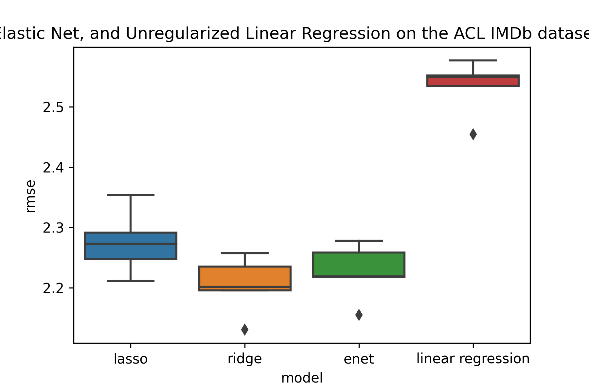

# IMDb Movie Analysis
This folder analyzes movie reviews from IMDb using the Large Movie Review Dataset by Mass et al from Stanford University. 

# Dataset Description
The ACL IMDb movie review dataset contains 25,000 plain-text movie reviews labeled as `x_y.txt` where `x` represents the sample ID, while `y` represents a numerical rating from 0 to 10. Half of these samples have positive ratings (>= 7), and the other half have negative ratings (<= 4). For the purpose of this experiment, we focus only on a random subset of 5000 samples from the training dataset of the ACL IMDb movie review dataset and later evaluate its performance on a subset of 5000 samples from the test dataset.

The dataset is separated into positive and negative reviews, with negative reviews having a numerical rating from 1-4, and positive reviews having a numerical rating of 7-10. For example, `pos/154_8.txt` represents the 154th sample in the `pos` (pos) category with a numerical rating of `8`, while `neg/7_3.txt` represents the 7th sample in the `neg` (negative) category. 

The dataset is comprised of movie reviews with an average length of 233 words with a standard deviation of 174 words.


An example negative review is shown below (`neg/7_3.txt`):
```
This is really a new low in entertainment. Even though there are a lot worse movies out.<br /><br />In the Gangster / Drug scene genre it is hard to have a convincing storyline (this movies does not, i mean Sebastians motives for example couldn't be more far fetched and worn out cliché.) Then you would also need a setting of character relationships that is believable (this movie does not.) <br /><br />Sure Tristan is drawn away from his family but why was that again? what's the deal with his father again that he has to ask permission to go out at his age? interesting picture though to ask about the lack and need of rebellious behavior of kids in upper class family. But this movie does not go in this direction. Even though there would be the potential judging by the random Backflashes. Wasn't he already down and out, why does he do it again? <br /><br />So there are some interesting questions brought up here for a solid socially critic drama (but then again, this movie is just not, because of focusing on "cool" production techniques and special effects an not giving the characters a moment to reflect and most of all forcing the story along the path where they want it to be and not paying attention to let the story breath and naturally evolve.) <br /><br />It wants to be a drama to not glorify abuse of substances and violence (would be political incorrect these days, wouldn't it?) but on the other hand it is nothing more then a cheap action movie (like there are so so many out there) with an average set of actors and a Vinnie Jones who is managing to not totally ruin what's left of his reputation by doing what he always does.<br /><br />So all in all i .. just ... can't recommend it.<br /><br />1 for Vinnie and 2 for the editing.
```

An example positive review is shown below (`pos/154_8.txt`):
```
"El Mar" directed by Catalonian director Agusti Villarona, and based on the novel by Blai Bonet, offers a glimpse of the Spanish history as seen by a Balearic author that takes the viewer back to the days of the civil war in that country. The movie concentrates on three friends, and follows them from those early days during the onset of the war in Majorca, to a few years later as two of those friends meet again when they are at a sanatorium, lost in the countryside.<br /><br />We first meet three boys that are playing happily. Not everything is what it seems. The tragic death of one of them points out about the cruelty of the one that commits the evil deed. The boys have excluded a young girl, about their age, from taking part in their games.<br /><br />When we meet the adult Ramallo again, he is on his way to a sanatorium. He seems to be suffering from tuberculosis. To his surprise, Manuel Tur, one of his boyhood friends is also being treated, and the young girl that was not welcomed to participate in their games is now one of the nuns that supervise their health care. It is obvious that Tur looks at Ramallo in a way that only means he is in love with the tough bully. Their relationship will have devastating consequences.<br /><br />Roger Casamajor does a good job with portraying the older Ramallo. Bruno Bergonzino makes an impression as Tur, the vulnerable youth. Antonia Torrens plays Sor Francisca with conviction. Angela Molina, puts an appearance as Carmen, the wife of the caretaker of the institution. Simon Andreu is perfect as Alcantara.<br /><br />"El Mar" is a dark film that clearly shows Agusti Villarona's talents in making the novel come alive for the viewer.
```

# Methodology
## Data Preprocessing
We use TF-IDF (Term Frequency - Inverse Document Frequency) to convert text into numerial covariates for regression. TF-IDF assigns each word `w` in a document `d` a score based on the term frequency (number of times w appears in document d / total number of terms in document d) and the inverse document frequency (total number of documents / number of documents containing term t). In the case of this dataset, a document would correspond to a movie review, and a term would correspond to a single word in the movie review. The purpose of combining term frequency and inverse document frequency is to highlight words that appear frequently within a document that are valuable for the regression. Common words such as "the" and "a" have a very low IDF-score, which keeps the TF-IDF score low. Performing TF-IDF on the IMDb dataset yields 44,798 covariates.

## Model Evaluation
We consider 4 different linear models: ordinary least squares, Lasso regression, Ridge regression, and ElasticNet.

We perform hyperparameter tuning on Lasso, Ridge, and ElasticNet to find the best alpha, and calculate the root mean squared error (RMSE) using cross-validation (k=5).

While RMSE evaluates how the model performs as a regression model, we can also adapt these linear models to predict the sentiment of the movie reviews. A review with a predicted rating above 5 would be labeled positive, and a review with a predicted rating below 5 would be labeled negative. We therefore calculate the accuracy as the number of samples that have their sentiment (positive / negative) predicted correctly.

# Results
We find that Ridge Regression performs best on the IMDb Movie Review Dataset, with an average RMSE of 2.32, with Lasso regression as a close second with an average RMSE of 2.38. The worst model is the Ordinary Least Squares model with an average RMSE of 3.36. The high RMSE of the Ordinary Least Squares model can be explained by the high dimensionality of the input dataset (~ 45,000 features), highly correlated covariates, and non-informative variables.

Lasso used a total of 4617 features, Ridge used a total of 22022 features, and ElasticNet used a total of 586 features.

When viewing this experiment as a classification problem by treating ratings above 5 as positive, we have the following results.

| model | accuracy  |
|-------|--------|
| lasso | 86.484 |
| ridge | 86.492 |
| enet  | 82.796 |
| ols   | 70.428 |

We can see that Lasso and Ridge regression have similar accuracy, with Lasso using significantly less features than Ridge. Thus, in the case of this experiment, the preferred model is Lasso due to achieving near-best performance (86.492%, RMSE of 2.38) using 10 times less features than the original feature set (44,798).




| model | avg rmse ± std |
|-------|------------------|
| ridge | 2.315311 ± 0.109337 |
| lasso | 2.388011 ± 0.115439 |
| enet  | 2.767987 ± 0.200707 |
| ols   | 3.367619 ± 0.071726 |

Bibtex citation:
```bibtex
@InProceedings{maas-EtAl:2011:ACL-HLT2011,
  author    = {Maas, Andrew L.  and  Daly, Raymond E.  and  Pham, Peter T.  and  Huang, Dan  and  Ng, Andrew Y.  and  Potts, Christopher},
  title     = {Learning Word Vectors for Sentiment Analysis},
  booktitle = {Proceedings of the 49th Annual Meeting of the Association for Computational Linguistics: Human Language Technologies},
  month     = {June},
  year      = {2011},
  address   = {Portland, Oregon, USA},
  publisher = {Association for Computational Linguistics},
  pages     = {142--150},
  url       = {http://www.aclweb.org/anthology/P11-1015}
}
```